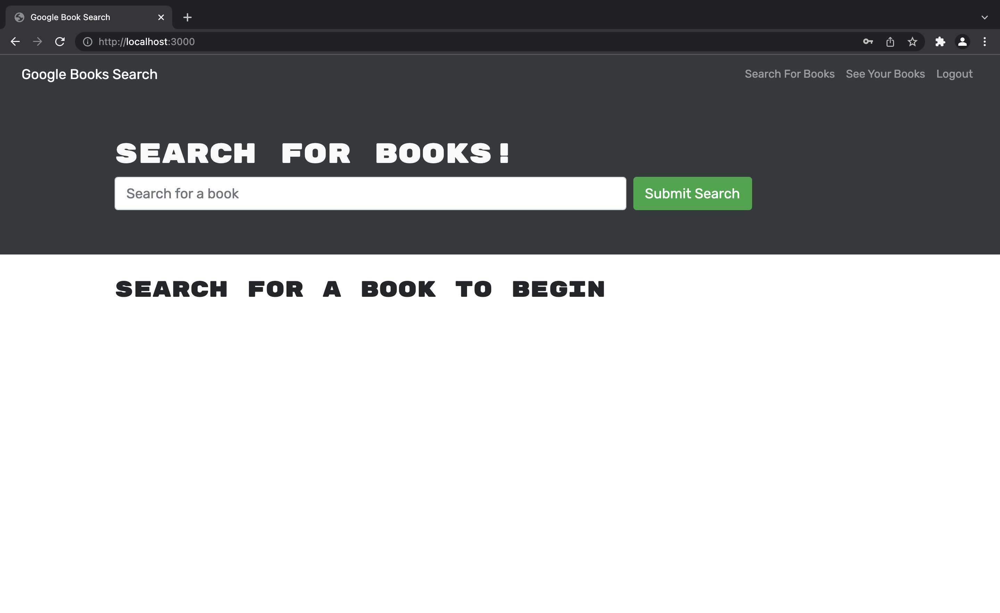
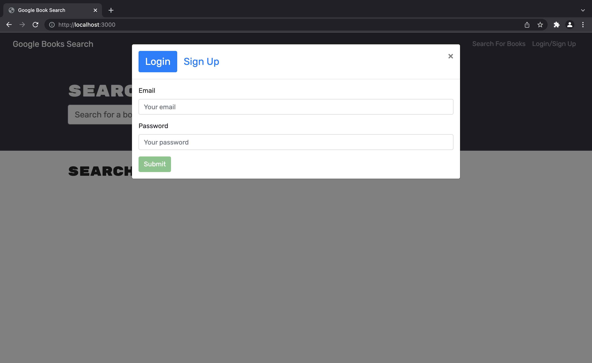

  

  # book-search-engine
  
  
  ## Description
  This application helps individuals track their total measurements in working out. It gives them the ability to see the total amount of weight and total time working out. This application's back end runs through MongoDB atlas. 
  
  ## Deployed Application
  https://stormy-inlet-79142.herokuapp.com

  ## Screenshot of application
   
   
   
  
  ## Table of Contents
  - [Installation](#installation)
  - [Usage](#usage)
  - [Contributing](#contributing)
  - [License](#license)
  - [Badges](#badges)
  - [Features](#features)
  - [Tests](#test)
  - [Questions](#questions)
 
  ## Installation
  When deploying locally
    `Npm i`  to install node_modules.  
    `Npm run develop`  to run application.  
  There you will be able to run the application locally.
  
  ## Contributing
  Feel free to add or change any code.

  
  ## License
  Community
  

  ## Features
  MongoDB, MongoDBAtlas, Heroku, Express, Node.js, React
  
  ## Tests
  N/A
 
  
  ## Questions
  If you have any questions feel free to contact me via email kevinc.php@gmail.com, Github kevin-cortina.
  